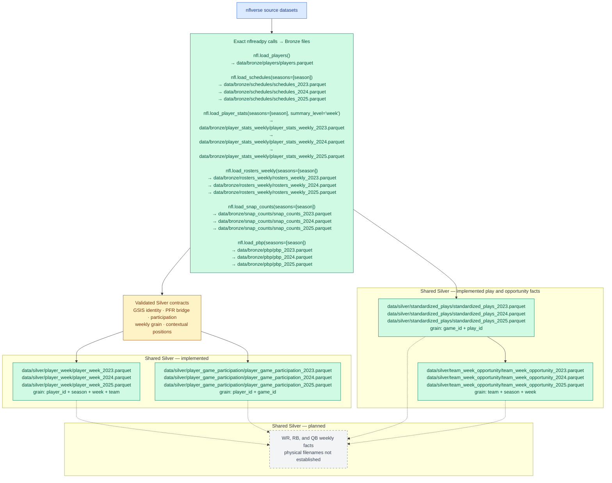
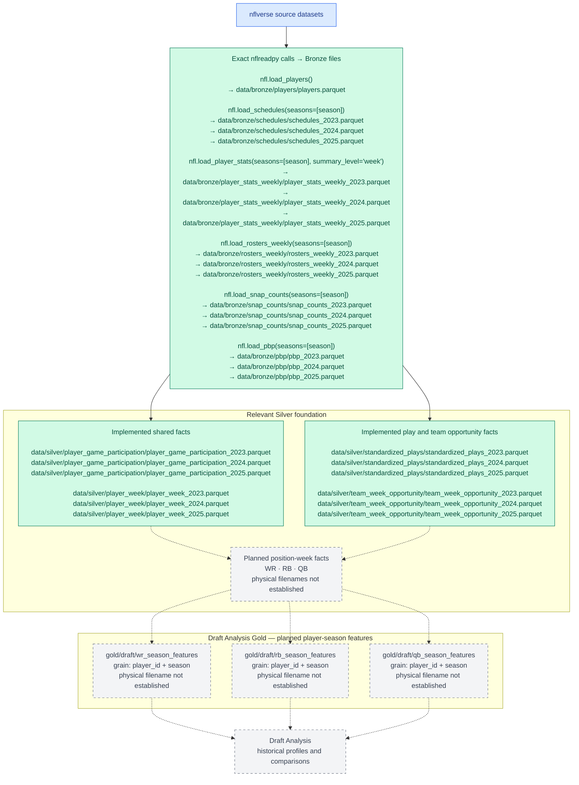
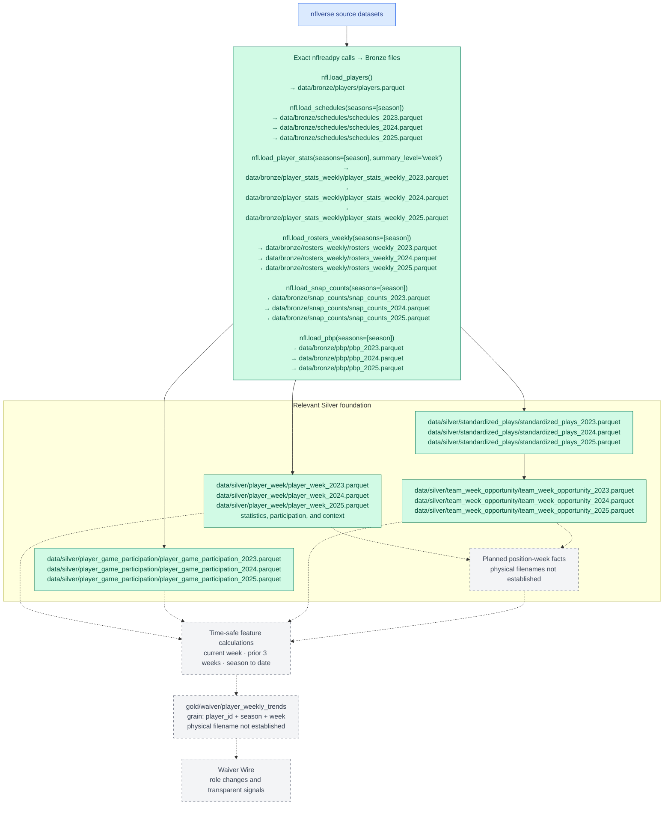
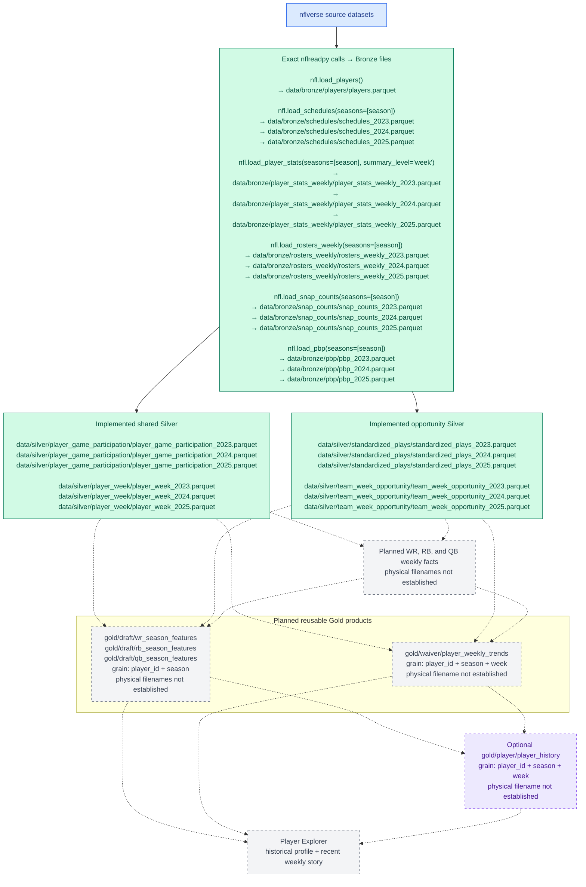

# NFL Dream Lab Data Lineage

Last updated: 2026-09-14

## Purpose

This is the canonical working data lineage for NFL Dream Lab. It presents the pipeline as four focused views, repeating relevant upstream layers so each Gold product can be followed without tracing a large web of crossing lines.

The diagrams show the current 2023–2025 direction. Green nodes are implemented and persisted, gray dashed nodes are planned, and purple dashed nodes are optional. The notebooks import `nflreadpy as nfl`, so the source calls below use that exact alias. Implemented nodes list the current Parquet filenames; planned nodes explicitly say when a physical filename has not been established.

## 1. Shared data foundation

This graph shows the common source, Bronze, and Silver foundation reused by every Gold product. Gold-specific transformations are intentionally omitted.

## 2. Draft Analysis Gold lineage

Draft Analysis answers what a player has historically demonstrated. Weekly football facts will be aggregated into position-specific player-season profiles for comparison, filtering, and percentile analysis.

Expected Draft features include validated volume, opportunity share, production, efficiency, scoring, and games-played context appropriate to each position. Exact feature definitions and dependencies will be established in future notebooks.

## 3. Waiver Wire Gold lineage

Waiver Wire answers whose role or opportunity is changing now. Its lineage remains weekly and time-ordered so recent trends can be calculated without using future games.

The rolling feature step must use only the current and earlier weeks available at each row. Initial signals should remain transparent—for example, rising usage or high opportunity with low production—rather than becoming an unexplained composite score.

## 4. Player Explorer Gold lineage

Player Explorer combines the long-term Draft view with the recent Waiver view. Its preferred design is to reuse those Gold products rather than rebuild the same features in a third pipeline.

`gold/player/player_history` should be created only if it offers a useful access shape that cannot be served cleanly from the Draft and Waiver Gold datasets. The diagram therefore shows both direct reuse and the optional materialized history path.

## How to maintain these focused views

When a planned dataset is implemented, update the relevant graph without expanding unrelated graphs:

1. Change the node from planned to implemented styling.
2. Replace dashed provisional edges with solid validated edges.
3. Use the final persisted dataset name and grain.
4. Keep detailed field definitions and validation evidence in the producing notebook or metric documentation.
5. Keep all four views consistent when a shared upstream dependency changes.
