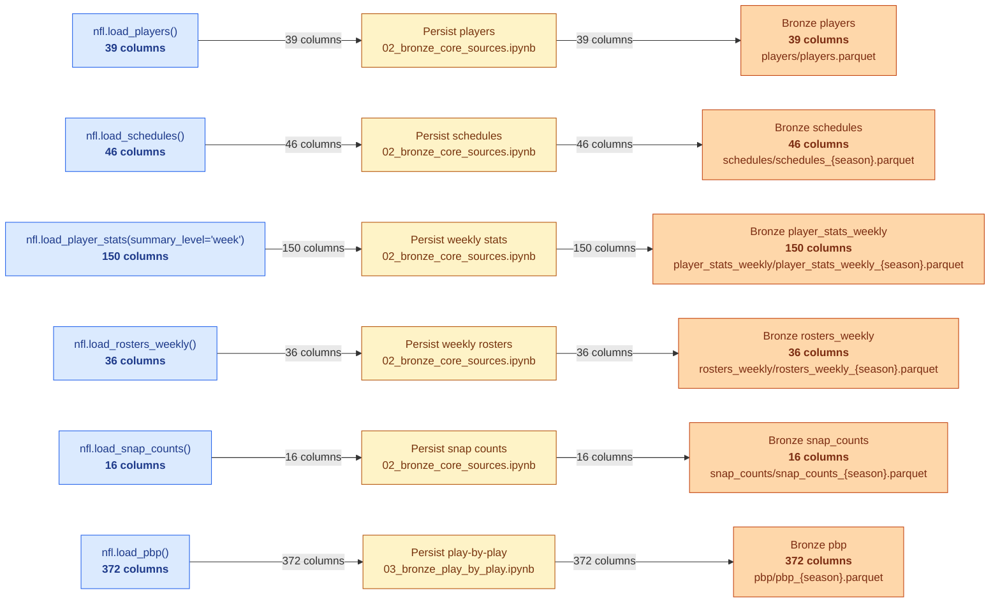
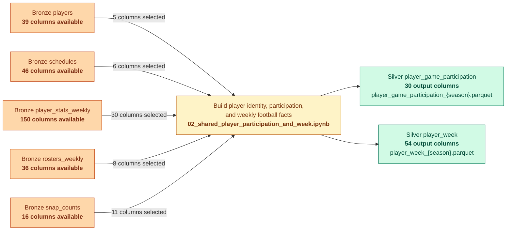
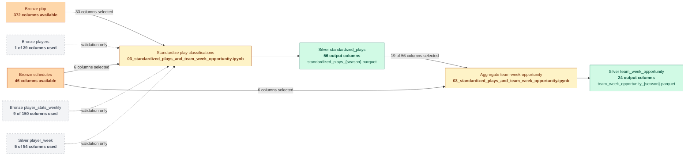
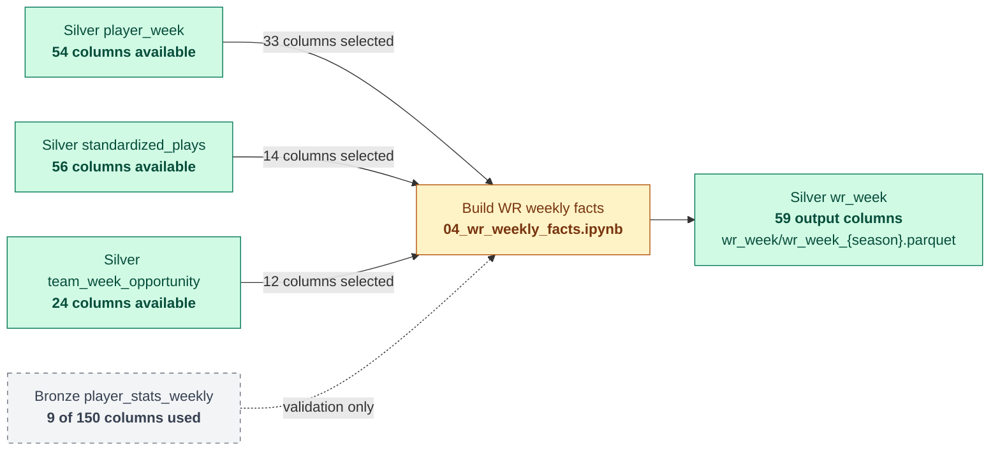
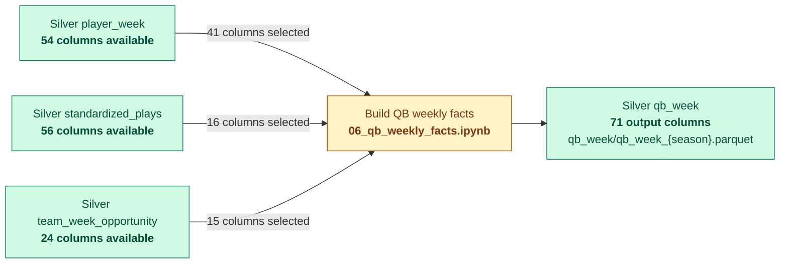

# NFL Dream Lab Schema Flow

Last updated: 2026-09-28

## How to read the diagrams

- Dataset nodes show the total number of columns available in the persisted dataset.
- Solid-arrow labels show how many columns the next step selects from that dataset.
- Dotted arrows are validation-only inputs and do not create the output schema.
- Selected input counts do not need to add up to the output count. Joins share keys, some inputs are omitted after use, and transformations add derived columns.
- Counts in the change-summary tables describe that specific type of change and can overlap. A column can, for example, be both renamed and type-standardized.

## 1. nflreadpy source to Bronze

Bronze preserves the schema returned by `nflreadpy`, so the source and Bronze column counts are equal.

### Output Data Details

| Step | Joins and shared keys | Renamed or standardized | Derived or transformed | Not carried forward |
|---|---|---|---|---|
| `nflreadpy → Bronze` | No joins. | **0 intentional column renames.** | **0 feature-engineered columns.** DataFrames are converted from Polars to pandas and written to Parquet. | **0 columns intentionally removed.** Source column counts are preserved in Bronze. |

## 2. Bronze to player participation and weekly Silver

### Output Data Details

| Output | Joins and shared keys | Renamed or standardized | Derived or transformed | Not carried forward |
|---|---|---|---|---|
| `player_game_participation` — 30 columns | Stats and snaps combine on `player_id + game_id + team`. Schedule, roster, and player-master enrichment use their respective shared keys. | **14 columns renamed or disambiguated** — includes `gsis_id → player_id`, source-specific position prefixes, `st_snaps → special_teams_snaps`, and snap-percentage renames. **6 snap fields type-standardized.** | **9 columns derived** — `season_type`, seven source or participation flags, and one consolidated `display_name`. | **24 selected stat columns excluded** from this participation-only output. Join helpers and source-specific fallback names are also removed. |
| `player_week` — 54 columns | Uses the same joined observations at `player_id + season + week + team`; `game_id` remains an attribute. | **24 columns renamed or disambiguated** — 14 contextual fields plus 10 weekly-stat names such as `attempts → passing_attempts` and `targets → receiving_targets`. **30 numeric fields type-standardized** across stats and snaps. | **9 columns derived** — the same context, source-presence, participation, WR, and display-name fields used by the participation output. | **227 Bronze columns not selected** across the five input datasets. Source fantasy points, precomputed shares, and join-only helper fields are omitted. |

## 3. Bronze to standardized plays and team-week opportunity

### Output Data Details

| Output | Joins and shared keys | Renamed or standardized | Derived or transformed | Not carried forward |
|---|---|---|---|---|
| `standardized_plays` — 56 columns | PBP joins to schedules on `game_id`; the `game_id + play_id` grain remains unchanged. | **20 columns renamed or standardized** — four canonical context names, 15 Boolean `source_*` flags, and integer `play_id`. | **22 columns derived** — 21 canonical `is_*` classifications plus `target_air_yards`. | **379 source columns not selected** — 339 from PBP and 40 from schedules. All PBP rows remain despite the column reduction. |
| `team_week_opportunity` — 24 columns | Plays group on `game_id + team`, then join to schedule team-game rows. Final grain is `team + season + week`. | **16 aggregated fields renamed** with the `team_` prefix, such as `is_target → team_targets`. | **17 opportunity metrics aggregated** — 16 Boolean counts and one air-yard total. **16 count fields** are standardized to integer zero when missing. | **77 input columns not selected** — 37 from standardized plays and 40 from schedules. Play descriptions, player IDs, and individual-play details disappear during aggregation. |

## 4. Shared Silver to WR weekly facts

### Output Data Details

| Output dataset | Joins and shared keys | Renamed or standardized | Derived or transformed | Columns not carried forward | Grain changes or aggregation |
|---|---|---|---|---|---|
| `wr_week` — **59 verified columns** | Receiver and rusher aggregates join to WR rows on `player_id + game_id + team`. Team denominators join on `team + season + week`, with `game_id` agreement required. Bronze weekly stats are validation-only. | **18 generated numeric columns standardized** — nine PBP counts use nullable integers, PBP target air yards and eight shares use nullable floats. **10 PBP fields are renamed as player opportunity aggregates.** | **18 columns derived** — ten player-game opportunity aggregates and eight same-week shares. | **75 schema-producing input columns not selected** — 21 from `player_week`, 42 from standardized plays, and 12 from team-week opportunity. The nine selected Bronze validation fields are not persisted. | The WR subset retains `player_id + season + week + team`; no aggregation changes the base output grain. PBP is aggregated from play to player-game-team before the one-to-one join. |

## 5. Shared Silver to RB weekly facts

### Output Data Details

| Output dataset | Joins and shared keys | Renamed or standardized | Derived or transformed | Columns not carried forward | Grain changes or aggregation |
|---|---|---|---|---|---|
| `rb_week` — **62 verified columns** | Rusher and receiver aggregates join to contextual RB/FB rows on `player_id + game_id + team`. Team denominators join on `team + season + week`, with `game_id` agreement required. Bronze weekly stats are validation-only. | **19 generated numeric columns standardized** — nine PBP counts use nullable integers, PBP target air yards and nine shares use nullable floats. **10 PBP fields are renamed as player opportunity aggregates.** | **19 columns derived** — ten player-game opportunity aggregates and nine same-week shares. | **69 schema-producing input columns not selected** — 21 from `player_week`, 38 from standardized plays, and 10 from team-week opportunity. The nine selected Bronze validation fields are not persisted. | The RB/FB subset retains `player_id + season + week + team`; no aggregation changes the base output grain. PBP is aggregated from play to player-game-team before the one-to-one join. |

## 6. Shared Silver to QB weekly facts

### Output Data Details

| Output dataset | Joins and shared keys | Renamed or standardized | Derived or transformed | Columns not carried forward | Grain changes or aggregation |
|---|---|---|---|---|---|
| `qb_week` — **71 verified columns** | Passer, rusher, and complete-dropback aggregates join to contextual QB rows on `player_id + game_id + team`. Team denominators join on `team + season + week`, with `game_id` agreement required. | **19 generated numeric columns standardized** — 12 PBP opportunity fields use nullable integers and seven shares use nullable floats. **12 PBP fields are named as QB passing, dropback, and rushing facts.** | **19 columns derived** — 12 player-game opportunity fields and seven same-week shares. Dropback identity combines passer IDs for attempts and sacks with rusher IDs for scrambles. | **62 schema-producing input columns not selected** — 13 from `player_week`, 40 from standardized plays, and nine from team-week opportunity. | The QB subset retains `player_id + season + week + team`; no aggregation changes the base output grain. PBP is aggregated from play to player-game-team before the one-to-one joins. |

Planned Gold datasets are intentionally omitted until their notebooks establish actual input selections and output column counts.
